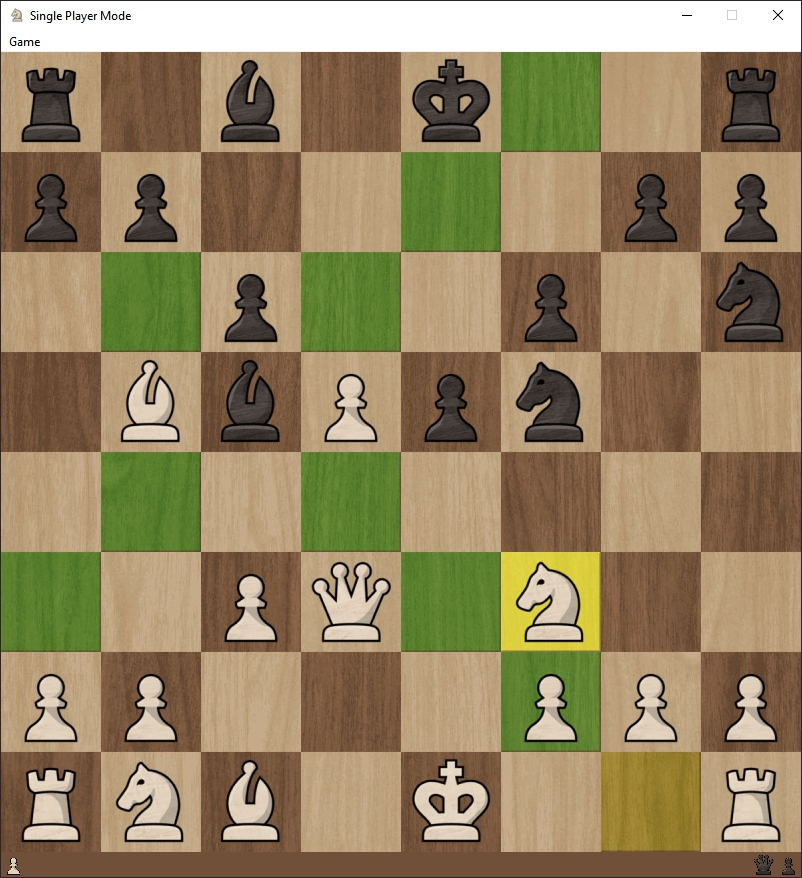

# Chess

A chess game made with Qt, supporting multiplayer LAN play.

## Features

- Single Player Mode (Simulate White & Black)
- Multiplayer Mode (Local Network)
  - Host Server
    - to host a server to play with remote friend, you must have a public ip address which can forward port `11451`
    - or use [Taiscale](https://tailscale.com/) to build and share a virtual local network with your remote friend
  - Join Server
  - Chat while playing
  - Taunt you opponent using F1-F8 key
- Replay Mode

## TODO

- AI Bot
- Frameless Window

## Source

Images: chess.com

Gameplay Sound: chess.com

Taunting Audio: Red Alert 2

