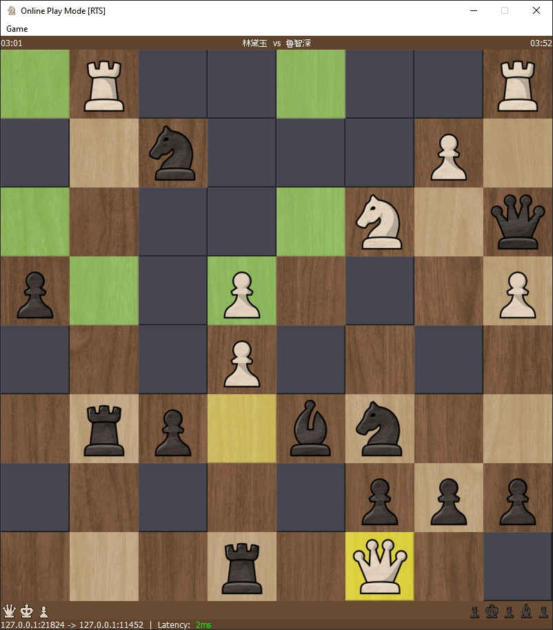

# Chess

A chess game made with Qt, supporting multiplayer LAN play.

## Features

- Single Player Mode (Simulate White & Black)
- Multiplayer Mode (Local Network)
  - Host Server
    - to host a server to play with remote friend, you must have a public ip address which can forward port `11451`(Normal Chess)/`11452`(RTS Mode)
    - or use [Taiscale](https://tailscale.com/) to build and share a virtual local network with your remote friend
  - Join Server
  - Chat while playing
  - Taunt you opponent using F1-F8 key
  - Timer
- Replay Mode

Also there are two Game Version

- `Chess.exe`: Normal Chess

  

- `Chess-RTS.exe`: RTS Mode. King can be eaten, and when your King is dead, you can only see the area that your pieces can move to, other place will be dark. In the end, the player whose pieces are all eaten will lose.

  

## TODO

- Replay Previous Move
- Frameless Window
- ~~AI Bot~~

## Source

Images: chess.com

Gameplay Sound: chess.com

Taunting Audio: Red Alert 2

